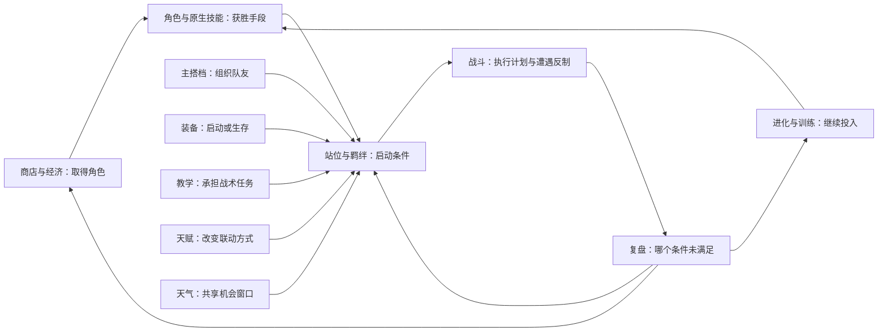

# 22 · 系统联动与玩法方案评审

2026-10-05；审查基线 `7c1262a`。本文保留设计评审时的方案与现状记录。

后续实施：护卫、晴雨窗口、技能机三选一、三键岗位配置与版本路由已进入
`tactics_v1` 可试玩原型，见[战术远征合同](23-tactical-expedition.md)和
[第八批报告](../reports/system-optimization-batch-h-2026-10-05.md)。反突进强度及自然终局目标仍未通过，
下文其余候选保持未实施；不能把这一子集视为整个设计批次放行。

第九批已确定**保留进化**，并在新开的 `tactics_v2` 战术远征中增加九尾日照、拉普拉斯降雨的
入场天气特性，见 [当前决策与合同](24-evolution-builds-and-opening-abilities.md)。训练尚未实现，
“最终形态池 + 独立升星”不再作为当前实施主线；天气阵容的强度读数仍未达到成熟平衡目标。

本轮只讨论现有 84 只宝可梦，不扩二世代，不新增永久战力，不修改现行对局。
下文中的新装备、教学、天赋、训练、天气切换是评审时的候选设计；实际入口与边界以上述合同为准。
所有新数值均需独立实验；现有基线读数与候选验收目标在下文分别标明。

## 1. 评审结论与证据边界

现在缺少的不是可列举的系统数量，而是玩家能连续回答的三个问题：

1. **这队靠什么赢？** 例如保护后排完成连续施法、抢先突破后排、承受第一波后反打。
2. **下一次资源应该投在哪里？** 是补启动、买前排、训练核心、留钱升人口，还是更换应对件？
3. **对手能怎样破坏这个计划？** 对应站位、抢启动、耗尽保护、干扰回能、压制治疗等有代价的选择。

推荐以“核心输出/承伤者 + 启动或保护者 + 可替换应对位”设计阵容。羁绊、道具、
教学、天赋和天气分别提供不同环节，避免同一套牌集齐后只得到多组永久增伤。

证据来源：

- [现有玩法和预算](20-expedition-partners-and-budgets.md)：5 搭档、3 教学、同费六维预算与实际边界。
- [四队 24,000 场实验](../reports/build-diversity-2026-10-05.md)：12,000 个成对试验，换边不算独立样本。
  原突进队对其他三队全部占优，控场队原站位没有优势对手；站位、装备已有真实取舍。
- 上轮 [64 局审计摘要](../reports/evidence/gameplay-audit-2026-10-05/pacing-summary.json)：经典/远征各 32 局，
  L2 机器人代操作玩家，四人格各 8 局，远征用无解锁装备/教学的喷火龙家族开局。
  玩家平均参与约 26 轮；远征 22/32 局在 R31 仍多人存活，需要排名收官。
  这是局长问题的信号，不是人类平均时长或全池平衡认证。摘要保留采样方法、逐局汇总和原始结果指纹。
- 本轮只做代码和设计交叉核查、物种/属性数量统计，没有运行任何候选规则的胜率实验。

### 与旧方案的差异

[13 号文档](13-core-gameplay.md) 曾提出“28 最终形态池、取消进化、独立升星、双装备槽、约 40 天赋”。
这些目标没有整体实装。当前推荐先保留进化和 84 池，以局内训练、有限定向招募、单装备槽和小天赋池
验证体系。旧路线保留为独立对照方案；本评审不把推荐写成已经批准的新规则，也不静默改旧档。

## 2. 每个系统负责什么

| 系统 | 负责的决策 | 联动方式 | 避免承担的职责 |
|---|---|---|---|
| 物种与原生技能 | 选谁承担输出、保护、突破或干扰 | 给其他系统提供明确动作和目标 | 普通物种只剩凑数；全部按图鉴号分配战术身份 |
| 主搭档 | 选择队伍的组织方式 | 用有限的回能、保护或治疗组织队友 | 再送一层自身全面增伤 |
| 羁绊 | 阵容投入到什么深度 | 让相关角色触发一项队伍配合 | 每项都给全队多种永久属性 |
| 教学/TM | 谁承担额外战术任务 | 护卫、天气、保护、打断对手计划 | 替换角色原生技能；无限增加技能槽 |
| 装备 | 启动、生存、输出或应对中选什么 | 改变携带者的一个关键环节 | 需要叠多件才有基本功能 |
| 天赋 | 本局采用哪一种联动方式 | 修改触发条件、受益对象或资源选择 | 必须先抽到某条才能使用基础反制 |
| 天气 | 在哪个窗口投入资源 | 放大已有属性和技能优势，双方共享环境 | 每队各自拥有一套互不影响的“全局天气” |
| 进化与训练 | 保留当前职责，还是改变形态/提高投入 | 进化换形态与招式，训练强化持有实例 | 把局内投入变成永久账号数值 |
| 商店与经济 | 为成型、成长或转型支付多少 | 普通商店负责随机与竞争，有限招募缓解卡关键岗位 | 无限指定核心、凭空复制共享池棋子 |

功能位标签只用于解释、招募和 AI，例如防线、施法、突进、干扰；本期不另加一套职业羁绊计数。

## 3. 问题索引

| 编号 | 审计问题 | 推荐方向 | 首次验证 |
|---|---|---|---|
| D01 | 后排施法前死亡，普攻视觉与规则不易区分 | 保护和有成本的启动；保留当前基本行动规则 | 第一批 |
| D02 | 普通角色定位不稳，进化可能改变职责；搭档意义不够清楚 | 显式角色定位、可继承的配队路线、搭档组织队友 | 第一批起 |
| D03 | 突进对原四队全部占优 | 有限护卫与阵型反制，不直接削弱全部近战 | 第一批 |
| D04 | 羁绊主要是数值，重复计数与薄属性有问题 | 不同物种计数；按覆盖设档；少量机制羁绊 | 第三批 |
| D05 | 道具前期缺席，功能装备少 | 前置既有供给，单槽下做应对选择 | 第二批 |
| D06 | 教学只有三种，普通角色缺战术任务 | 补护卫与实际可获得的保护教学，再加天气教学 | 第一至三批 |
| D07 | 海克斯未实装 | 9 条左右的小池，三次方向选择 | 第三批 |
| D08 | 天气只是固定倍率 | 基础天气预告 + 每队有限改天气机会 | 第三批 |
| D09 | 终形态停止成长、同费进化反馈弱 | 保留进化，比较独立训练与完全升星路线 | 第二批 |
| D10 | 核心依赖随机刷新、缺过渡与替代 | 功能位路线 + 有限定向刷新 | 第二批 |
| D11 | 缺有效后期消费，AI 不理解组合 | 资源投入评估与新机制同时交付 | 每批 |
| D12 | R31 强制排名频繁，缺实测操作时间 | 终局压力分臂实验，三个时间账分别记录 | 第一批采集，第四批调节 |
| D13 | 四个挑战很快耗尽 | 体系挑战、横向解锁、可选难度契约 | 第四批 |
| D14 | 联动不可读，三键操作可能越来越重 | 棋盘关联预览、一次提交、关键原因复盘 | 每批 |
| D15 | 预设满装队不能证明真实成型；存档/回放需承载新规则 | 分层验证、规则版本、有限触发协议 | 每批 |

## 4. 逐项方案评审

### D01 · 普攻、启动与技能可见性

**现状。** 80 能量在下一次合法出手时放大招，普攻/受击回能为 21/10。前排受击是主要启动来源之一。
目前模拟器没有可被打断的“正在读条”阶段，动画前摇是表现时间，不能用截断动画取消已结算伤害。

**比较。** A：全体提高初始能量或压低门槛，上手直观，但也加强突进和第一波爆发。
B：保留基础循环，通过站位保护、搭档接力、启动装备争取施法，形成资源取舍。推荐 B。

保留无属性普攻，角色详情和战报明确区分普攻/原生大招；属性粒子不暗示普攻发生属性克制。
先按后排/前排、角色、费用、阶段统计“施法前阵亡”和满能等待原因，再决定是否存在需要单独修正的角色。
不以“所有单位每场必须放出大招”作为目标。

**联动与代价。** 聚光镜换掉生存或伤害装备；护卫占辅助的教学槽；雷丘接力要求站位与普攻机会。
能量干扰、快速击破护卫和分散站位是应对方式。

**验收。** 固定同阵容比较首次大招时间、未施法原因、有效技能次数、受到保护的伤害；
要求保护/启动在适合对局中产生收益，在不适合对局中有放弃输出或续航的代价。
不先改全局攻速、移动、能量三个变量再归因。

### D02 · 角色身份、普通角色与主搭档

**现状。** 76 只通用技能按定位和物种 ID 分配。当前皮卡丘是近战冲锋，雷丘变为远程连锁；
鲤鱼王得到散射。机制能够运行，但不保证同一进化路线的战术职责连贯。

**比较。** A：给全部角色重做专属技能，制作成本大，也不能单独解决队伍配合。
B：先为每个目标体系选择低费过渡、核心、辅助、替代位，显式配置这些角色的职责，复用有限技能原语。
推荐 B；普通角色也可以是不可缺少的护卫、天气手或应对位。

搭档保持“一名家族成员获得队伍特性”，其他抽到的角色保留完整原生技能。第一批保留当前五种特性，
先验证贡献；需要分支时，由后续天赋**替换**指挥方式，不叠加第二份无条件特性。未部署搭档时明确显示特性未激活。

**联动与代价。** 输出角色提供伤害，低费功能角色带保护/天气教学，搭档组织回能或治疗。
辅助挤占人口，有时升级辅助比再塞一个高费输出更合理；另一局也允许放弃辅助追求抢攻。

**验收。** 每个首发体系至少两种过渡和两种岗位替代，不依赖六只指定终形态。
记录普通角色的保护、启动或干扰贡献，而非只看伤害排名；进化前后预览职责变化。

### D03 · 突进与反突进

**现状。** 已有冲锋、胡地闪现、普通击退和隆隆岩畏缩；尚无可配装的护卫、稳定嘲讽或目标拦截。
棋盘只有两排纵深，单纯“后排再往后放”没有足够空间。

**比较。** A：整体降低近战伤害/移动速度，简单但容易同时削弱普通近战。
B：提供有限次数、依赖站位的防线能力，让突进仍能通过另一侧、多点突破或先消耗保护获胜。
推荐 B，第一实验只加一种新原语。

**候选：护卫教学。** 准备期选择一名相邻队友，开场固定标记，每队每场一次。
敌人的冲锋/闪现技能确实完成了非零合法位移，且本次原目标在攻击者正常射程内、即将结算主命中时，
若护卫仍存活、与被保护者相邻，且距攻击者最多两格，则改由护卫承受本次主命中。距离统一用四向曼哈顿距离。
这是**仅限该次拦截的射程例外**：允许近战主命中交给相距两格的护卫；不移动护卫，
不改变攻击者后续锁敌、普攻射程或下一次技能的合法性。其余敌我、存活等目标检查照常。

例如满能冲锋者起点 `(3,0)`，当前锁定的敌人在 `(4,0)`；被保护者在 `(2,2)`，护卫在 `(3,2)`。
冲锋按现有最远敌人规则选中被保护者，经 `(3,1)` 到 `(2,1)`：原目标距攻击者一格，
护卫距原目标一格、距攻击者两格，可以拦截。额外的起手锁敌让这次施法满足现有合法出手条件。
若仍要求护卫也在近战一格内，四向网格无法组成这组三个相邻位置，护卫会对近战冲锋完全失效。
表现上显示被保护者与护卫之间的承伤转移，不把两格例外画成所有近战都能隔空挥爪。
不额外赠送减伤；改变目标后，溅射中心、吸能、状态、受击回能等都按**最终目标**计算。
护卫不递归保护另一个护卫；条件不满足则正常命中原目标，不吞伤害、不消耗保护次数。
确认重定向即消耗这次保护，随后按护卫计算命中/闪避/免疫；没有造成伤害也不返还次数。

第一原型每队至多提供一个有效护卫标记，避免全队互保；启用者与标记对象在准备页明确显示并随 UID 保存。
有多个已学护卫的单位时选择一个启用，其他显示未启用，不在启用者死亡后自动接力。
启用者与对象均由玩家明确选择；自动建议才按阵型相对坐标稳定排序，不能按 team0 或列表先后偷偷决定。
摆位、出售、进化导致标记无效时提示重选；不得开战后悄悄改保另一个角色。
这是目标结算的新能力，**不是阻挡画面中的弹道，也不意味着可以打断动画前摇**。

**联动与代价。** 水箭龟学护卫就不能同时学冲浪；卡比兽学护卫就放弃睡觉。
受击回能会让护卫更快施法，必须一起计入收益。阵型紧密有利于护卫，却更容易被喷火龙群伤覆盖。
多点突进、先杀护卫、从不受保护的侧翼进攻提供反制。

**验收。** 原四队成员与费用固定，只换同数量教学、装备或站位；保留失败样本。
定向验证上面的近战拦截、护卫不相邻、超出两格、位移失败/原地出手、护卫先死亡，
以及棋盘旋转 `(x,y) → (5-x,3-y)` 后相同语义。覆盖重定向后的免疫、状态、溅射中心、死亡、受击回能和同刻竞争；
后续普通攻击仍只按原射程和锁敌规则判断，不能继承这次两格例外。
如果拦截无法产生合理取舍，再试同预算的短时保护效果，不同时加入嘲讽、护盾、拦截和击退。

### D04 · 羁绊计数、层级与机制

**现状。** 同种副本重复计数、双属性都计数，大多数收益覆盖全队。薄属性中冰 1 种、钢 2 种、
幽灵/龙各 3 种、恶 0 种。若按家族去重，草/电/格斗/超能等只有 3 个家族，原 4/6 档无法正常成立。

**比较。** A：保留副本累计，允许六只同种堆高档，但难形成岗位搭配。
B：按不同物种/形态 ID 计数。C：按进化家族计数，需要连同大多数档位和池子重做。推荐 B。

同形态副本只贡献一次；妙蛙草与妙蛙花仍是两种。界面写“不同物种”，明确允许同族不同形态协同。
大池属性候选 2/4/6，电 2/4，幽灵/龙 2/3，钢只设 2；冰暂作为属性和教学相容性标签，
恶不展示不可达羁绊。薄属性达到最高档不自动获得六单位齐射的相同收益。

先只做两种机制档原型：

- **电 4：继电。** 本系单位的原生大招后，将少量能量交给另一名低能量队友，每队有限次数。
  替换旧 4 档的部分属性预算，不在旧收益之上免费追加；派生效果不再次触发继电。
- **草 4：共生。** 草系单位的原生/学习技能或搭档特性发起的一次实际治疗，可以给被治疗者短时保护，每个受益者每场最多一次。
  不按溢出治疗计算；使用保护原语，不默认引入独立护盾资源池。继承低档，替换高档部分旧收益。
  草系单位学睡觉也是可用来源，不能让整套羁绊必须先买到妙蛙花才能触发。

六档暂保留一次开场齐射作为深度投入的回报；齐射不触发回能/教学/天赋连锁。
其他属性先保留已有机制，不一口气把 17 系全部加新触发器。

**联动与代价。** 草需要实际治疗来源，水与剩饭可改善生存但不能冒充“草系施加的治疗”；
电需要能施法的相关角色及未满能受益者。为了四种角色必须牺牲部分功能位，不能靠复制一只达成。

**验收。** 自动检查所有档位在候选池可达；同种/同族/双属性计数、进化后档位变化、镜像齐射稳定。
按不同物种去重必须与成长/过渡同时评估，避免强迫玩家保留没有贡献的低阶形态。

### D05 · 装备供给与功能装备

**现状。** 一件装备槽；保底组件在 R5/R10 战后发放，通常 R11 准备期才自然凑够一件成装。
加发组件和局外开局装备可以提前，这里描述没有这些额外来源的保底路径。
聚光镜、剩饭、披带已有价值，但许多早期回合没有装备参与。

**比较。** A：立即改双槽、增组件和成品，复杂度及供给需求同时上升。
B：先调整既有资源到达时间，并加入少量有代价的应对件。推荐 B，暂保留单槽。

供给先试“前置”而非纯加发：R1 准备期获得原 R5 保底组件，R5 战后获得原 R10 保底组件；
R10 战后不再重复发这份，R15 战后起回到原节奏。加发追赶组件独立保留。
这样 R10 战后累计保底数量不变，但 R6 准备期即可合成；同时统计提前淘汰者获得资源的变化。
“随机组件”与“同预算三选一组件”作为两个独立试验臂，不混在一次修改中。
三选一臂在有适用载体时，至少提供一个能和现持有组件合成可用装备的选项；其他选项允许投资后续路线。
没有兼容进化角色时合成一块进化石，不计为一次有效的战斗装备成长，避免只优化组件数而没有改变玩法。

首批只选择两件候选功能装备进入原型：

| 候选 | 两组件配方与来源 | 行为 | 联动及代价 |
|---|---|---|---|
| 封疗针 | `band + charcoal`，消耗既有组件合成 | 首次原生大招对最终主目标施加短时减疗，时长/比例待测 | 针对续航；放弃使用这些组件做攻击装/幸运蛋，以及携带聚光镜的机会 |
| 净心护符 | `bell + mysticwater`，消耗既有组件合成 | 首次受到可解除的主要控制时清除该状态，每场一次 | 保住启动或天气手的一次行动机会；与剩饭/聚光镜争铃铛，后续控制仍有效 |

两配方当前没有命名成品，默认产物是进化石。新原型保留“任选两组件主动合进化石”的既有能力，
改变的是配方推荐和 AI 选择，不能用新配方暗中取消通信进化途径。两件均不免费发放、不新增组件种类，
列入第二批，与供给前置分别测试后再组合；没有控制/治疗的对局允许两件都不选。

供给前置也会让幸运蛋更早出现，不只是让战斗装备早五轮。幸运蛋全桌最多两件，备战携带者也能产金。
供给实验必须交叉比较旧/新时间表与幸运蛋启用/禁用（禁用只用于归因实验），最后回到完整启用规则验证。
记录第一枚蛋出现轮次、持有人、直接额外金币和利息变化，不能把滚雪球收益全部归因于战斗装备。

减疗单独记录为有限战术修正，不占掉原有灼伤/中毒的唯一主要状态位；同类只取较强值，不相加。
净心不解除位移、不改变已经结算的伤害，不等于永久免控。现有“天气石”先改清楚显示说明或名称，
保留旧存档 ID；不要在没有主动天气规则时把减伤称作改天气。

**验收。** 成装首次出现轮次、组件闲置率、特定配方可获得性、有效携带条件下的选择率、
换成通用输出装的机会成本；核心通常要在“一次更早的技能”和“一次免控机会”之间选择。

### D06 · 教学与状态来源

**现状。** 居合斩/冲浪/睡觉均每场有限触发。光墙、反射壁、剑舞有模拟函数，
但实验入口存在不等于玩家能正常取得与使用。

**比较。** A：给每只增加多个技能槽，全面增加操作和联动数量。
B：维持一只一个教学槽，让同种宝可梦承担不同战术任务。推荐 B。

第一批加入护卫；保护原型可以从光墙/反射壁中择一，明确获得途径、兼容角色、有限目标和有效窗口。
教学是额外任务，不覆盖原生大招。后续新增晴天/求雨时同样占这个槽，因此保护、续航、天气、追加伤害互相竞争。
不一次把所有实验 Buff 变为可叠加常驻效果。

首批教学补给候选：R5、R10 战后的既有机器奖励改为三选一，R6/R11 准备期选择，数量不变；至少一项当前持有角色可用，
一项适合转型，第三项可为通用教学。同一三选一不会同时保证护卫、天气、输出三种收益全得。
保持卖出/替换返还机器；选择结果和候选集合存档，不能退出页面重掷。

**验收。** 从实际掉落到三键学习再到战斗效果，不只测直接给 Unit 装上技能。
每种教学有兼容/不兼容、替换、合成继承、死亡、无目标与一场次数的用例。
同一角色不同教学应改变队伍用途；基础反制不能只在罕见天赋中出现。

### D07 · 海克斯/天赋小池

**现状。** 未实装。推荐先 9 条左右，在 R2/R8/R14 提供三选一：定方向、补短板、改变后期打法。
每轮一次确认，不逐角色分配三遍。选项同阶段预算接近，不做一眼必选的“传奇比普通强一倍”。

候选池如下，名称只是工作名，比例和持续时间不作为已定数值：

| 候选天赋 | 只改变一件事 | 必要条件与边界 |
|---|---|---|
| 余势追击 | 原生大招后下一次普攻获得一次追加伤害 | 每单位最多两次；追加包不回能、不触发下一条追加 |
| 并肩守望 | 拦截的主命中结算完毕后，存活护卫获得短时保护 | 不追溯减免本次主命中，不增加拦截次数；没有护卫来源时不作为当前适配选项 |
| 蓄势待发 | 开场保持原格一段时间的单位获得一次能量 | 被位移/主动移动即失去资格；先验证是否过度强化全镜队 |
| 振作 | 首次从低血线被实际治疗救回的单位，缩短一次行动等待 | 每受益者一次，不立即追加一次出手，不解除控制 |
| 顺势进攻 | 技能确实击退敌人后，另一友军下一次主攻击对其增伤 | 不含造成击退的本次技能和派生包；标记短时、一次、队伍总次数有限；遇墙未位移不触发 |
| 晴空协同 | 我方成功制造晴天后，给一个草/火队友短时保护 | 每场一次；同刻天气冲突失败不触发 |
| 雨幕掩护 | 雨天中每名水系单位首次实际受伤后，若存活则获得保护 | 本次伤害先结算，不救回已死亡单位；一次，雨本身不加强电系招式 |
| 定向补给 | 获得一次额外功能位刷新资格 | 正常付刷新和购棋金币，占一次天赋选择，不生成免费棋 |
| 转训准备 | 每局一次把一名棋子的训练投入迁移到另一名 | 只能准备阶段，消耗本天赋；不复制进度，不能绕过第二阶段开放轮次 |

这些天赋跨队可用，但适配条件不同。发牌建议“一项与已有可用来源适配、一项通用、一项转型”，
用当轮冻结快照判断，不扫描未来商店，不固定赠送某个最优组合。对不满足条件的选项标明缺什么。
候选不足时用同预算通用项补足；不显示永远无法触发的占位选项。
依赖护卫/主动天气的天赋只有在已经获得对应来源后才进入适配位置；转型位置可以给远期方向，
但每次至少一个选项当前可用。新账号与全解锁账号分别测，不能用成熟开局装备掩盖新账号的选项空缺。

**验收。** 完成三次选择状态、恢复和机器人选择后，才讨论扩大池子。
统计符合条件时的选择率、实际触发率、不同对局收益、从另一选项换过来的损失。
出现始终不选/始终必选的选项要复核，不以“九条都能触发”认领成功。

### D08 · 天气作为可争夺窗口

**比较。** A：继续做固定环境并提前预告，成本低但主动性有限。
B：仅给各队自身天气 Buff，容易理解但失去共享环境语义。
C：保留阶段基础天气，再允许有限的全场天气覆盖。推荐 A 作为基础，C 作为联动原型。

第一版只增加晴天/求雨教学，不同时做沙暴全场 DOT、冰雹冻结和四种新气象特性。
每队只允许一名已部署的天气教学者有效，准备页选择并固定这只棋子；其他天气教学者显示未启用，不能偷偷后备接力。
有效教学者首次原生大招结算后请求一次短时全场天气覆盖，不替换该次大招；每队每场最多一次请求。
选择天气放弃睡觉、护卫或冲浪等教学，施法前被击倒就失去这次机会。

边界建议：

- 全场同时只有一种有效天气；它影响双方，不能让自己的雨加强己方水，却不帮助敌方水。
- 后到的有效请求覆盖先前天气；覆盖到期恢复阶段基础天气，不恢复被覆盖的上一层，避免天气栈。
- 同一模拟 tick 的不同天气请求统一收集后抵消，恢复基础天气，两边均消费机会；不按席位先后判胜。
- 相同请求只取更晚到期点，不把时长相加。被抵消的请求不触发“成功制造天气”的天赋。
- 候选覆盖时长先用有限短窗口实验；新天气从下一 tick 生效，不追溯改写发起它的那次伤害。

**联动与代价。** 妙蛙花实际造成更多草伤后可转化更多治疗，晴天同时帮助喷火龙；
对手求雨可以削弱这段火系窗口。雨队强化水箭龟并降低火系压力，给主搭档雷丘的两次普攻接力争取时间；
接力只在选择该搭档且部署获特性的成员时存在，只认前两次有效普攻，受益队友需在两格内，并非持续产能。
电伤不凭“雨天导电”的想象自动提高。天气手占人口和教学槽、需要启动保护，本身就是可攻击的薄弱点。

**验收。** 比较基础天气、己方改天、敌方覆盖、同刻冲突、天气手被击杀五种场景。
记录有效天气时长、双方收益、放弃其他教学的损失；回放必须显示真实开始/结束和来源。

### D09 · 进化、训练与后期成长

**现状。** 终形态不再三合一；直接购买与合成出的形态没有独立星级区别。
远征同费形态总面板预算一致，部分进化更接近职责变化。自动合成还可能减少人口和羁绊人数。

| 路线 | 优点 | 代价 | 判断 |
|---|---|---|---|
| A：28 左右最终形态 + 三星 | 追卡目标直接，重复终形态有用 | 重做池子、费用、供给、进化石、搭档开局、存档与 AI | 保留为独立原型，不在本轮混入 |
| B：保留进化 + 持有实例训练 | 保留宝可梦成长体验，普通/终形态都能继续投入 | 需清楚区分形态和练度，控制叠加预算 | 已选主线；保留进化已定，训练尚未实现 |
| C：只增加全局属性或装备掉落 | 改动小 | 没有解决角色持续成长，容易变成整体膨胀 | 不作为主方案 |

推荐训练原型：实例练度 0/1/2，第一阶段候选 R8 开放，第二阶段候选 R14 开放。
训练使用金币，价格按物种当前费档计算；不再增加一种可囤积的碎片货币。
每次训练只给一项明确强化，首轮先试统一、可解释的面板投入，先不做 84×多分支技能树。
训练支出与购棋投入分开记账，避免同一支出被卖价和训练退款重复返还。
训练账记录真实付款、转入、已退和已结清金额，不能只按当前练度反推出“应该付过的钱”。

进化保留指定实例的练度，材料棋子的练度不相加。令 `C(费档, 练度)` 为该费档达到此练度的累计价格，
`P` 为保留实例尚未退款、尚未转出的实际训练本金；跨费档进化须补 `max(0, C(新费档, 原练度) - P)`。
例如训练过的鲤鱼王进化为暴鲤龙，不能用一费训练价直接获得三费练度。
差价须在合成/用石预览中确认，余额不足则暂缓整笔进化，不扣材料、不占目标池、不消耗石头。
材料训练折损退款也计入同一次预览的净收支，足额判断以该原子事务完成后的余额非负为准。
未训练实例沿用原自动合成；已训练且要补差价时必须确认。低费过渡的价值是早期便宜地变强，之后仍可选择卖出转型。

合成材料的训练按与卖出相同的折损规则退金，同时关闭材料的训练账；这笔本金不能再次并入保留实例。
卖出只返还部分未退实际本金，累计返还不超过对应真实支出。免费奖励的本金记零，不能转售套金币。
转训第一版只允许转入练度为零的实例：清空来源练度和本金，根据可转本金、目标当前费档价格及当前开放阶段重新计算练度；
分配到目标训练账的金额只记一次，不能直接复制等级。无法形成下一级的剩余金额按相同折损规则退金并结清，
没有达到一级所需金额则不给“无效转训”提交入口。进化→转训→卖出不能重复使用同一笔本金。

三合一暂保留，同时提供“暂缓进化/锁定形态”和合成前后的阵容预览。
同费进化的收益必须把损失的人口、羁绊、金币与获得的技能一起计算；若没有正当用途，
优先调整对应进化路线/明确形态分工，或另开 2 合 1 对照，不用给全体进化免费额外属性掩盖问题。
重复终形态本期仍可作为第二个战斗单位或卖出，不用换训练券制造低费材料刷取循环；
若真实体验仍强烈需要追重复卡，再用路线 A 单独比较。

通信进化还需单列路径成本：当前用进化石获得的胡地/怪力/耿鬼永久占用唯一装备槽，石头不能卸下，
直接购买同形态则没有这个限制。第一原型保留此基线，预览明确“进化后不能再装聚光镜等装备”。
需要聚光镜/封疗针的核心走直购路径，石头路线的装备交给其他队友，不能在满装实验里抹掉这个区别。
后续可单独比较“一次消耗石头，形态保留且释放槽位”，它会改变通信进化价值和旧档，须另做迁移及预算实验。

**联动与代价。** 给当前核心训练，意味着少一次升人口或少若干次刷新；给护卫训练也能争取队伍启动。
早期角色可以继续承担功能位，进化改变职责前玩家能看到失去什么。

**验收。** 相同累计金币下比较训练核心、增人口、刷新换人，任何一路都不能所有阶段占优。
检查低费养成是否有过渡价值、直购/三合一/带石进化的取舍、跨费档补差价和材料返还/转训/卖出循环守恒，
以及旧档不凭空获得练度。训练价格与倍率是需要实验得出的未决数值。

### D10 · 商店、成型路径和替代位

**现状。** 84 种分布为 34/32/18 个 1/2/3 费物种。满级四格商店出现某指定三费牌的概率约 5.44%
（所有物种仍有库存的初态）；不能依靠六张指定核心来定义唯一可玩阵容。

**比较。** A：直接缩池，改善搜牌但同时改变竞争、羁绊和进化。
B：保留普通商店，通过少量功能位定向刷新解决缺一个关键岗位。推荐先 B，与路线 A 分开测。

候选规则：在少量固定成长节点获得功能位刷新资格，将**下一次付费刷新的一格**优先匹配所选功能位，
其余三格照常；所有格仍按当前等级费档概率和共享库存抽取，买入照常付钱。
该费档没有相符物种时按预先公开的同档通用候选回退，不越级白送三费牌；选择时说明此回退规则。
若当前所有可抽费档均无匹配库存，则不允许消耗该方向的资格，先提示改选或保留。
资格一次使用，候选、预留、退回与刷新序号一起持久化，不能重新进页面刷候选。

功能标签不等于指定物种。早期缺前排可补防线，后期遇到续航可找干扰；仍允许没抽到喷火龙时换一个施法者。
物种标签必须来自显式设计，而非只看 BST 或物种 ID 奇偶。

**验收。** 记录到 R8/R14 的“有完整职责”比例，而非只记录精确六张牌是否集齐；
同时测两人同行、三人争同一资源、空池、商店锁定、取消及重复提交的池守恒。
单一谱系不能因定向刷新成为唯一高收益追法。

### D11 · 经济、AI 与资源变现

**现状。** 已有利息、连胜/连败、买经验和刷新。AI 的主要估值仍来自 BST 与档案倍率，
无法充分估计教学、搭档距离、天气窗口和特定对手；更高能力级别并未稳定表现更强。

推荐保留当前收入先做消费出口，再调整总量。否则低消费可能来自“无处有效投资”或“AI 不会用”，
直接减收入无法区分原因。

AI 每次比较“保利息、买可用角色、升级人口、训练、换装备/教学”的短期与阵容收益。
同样遵守三选一、共享池、库存和一次触发规则；只能使用该阶段玩家也能获得的侦察信息。
L1 识别单体与经济，L2 理解阵容触发条件，L3 针对可见对手换位/换装，不额外加钱或窥探未来商店。

**联动与代价。** 不再仅因低 BST 卖掉天气手或护卫；也不因为凑四羁绊而保留完全没有贡献的棋子。
新物种职责/教学/天赋与对应估值应同批完成，避免只让玩家获得新功能。

**验收。** 多种人格与独立种子下统计出局存款、错过的可购买强化、转型次数、条件触发率和名次分布。
比较旧/新 AI 时先固定规则；比较新规则时固定 AI 版本，再做组合臂。不能让两者同时变化后归因。

### D12 · 局长与终局

**现状。** 最高 R31，超过仍按 HP/等级/席位排名。64 局抽样的高强制排名率说明当前自然收官不足；
人类准备时间和三键操作耗时尚无足够样本。

**比较。** A：全面提高掉血，能缩局，但减少成型机会。
B：仅后期增加明确预告的淘汰压力。C：最后两人进入对决赛制，改变配对与存档流程。
先测 B，C 留为规则更清晰但工程更大的独立方案。

实验把三件事分开：后期败方最低扣血、后期存活敌人数系数、终局是否还安排奖励型野怪轮。
不直接增加战斗内伤害，也不一边削治疗一边宣布局长改善。
若取消某个终局野怪战，其本来承诺的资源发放和战利品 UI 必须明确处理，不能无声吞掉奖励。
已淘汰玩家保留立即结算/查看结果，不要求继续观看整桌余下战斗。

候选目标：独立样本自然决出冠军比例至少 90%，同时不明显提高中期前的淘汰率；
这是新实验目标，当前未达成。先观察强弱队成型机会，再确定具体结束轮次与时间目标。

**验收。** 玩家退出轮次和整桌收官轮次分开；准备、生成/加载等待、播放三项分开计时。
2 倍速只改变播放时间，不改变随机数、数值或奖励；新旧终局臂同时报告前四率与成长完成度。

### D13 · 局外成长与反复游玩的理由

**现状。** 四项挑战理论上首局即可满足，解锁集中在开局搭档、三种教学和两件装备。

**比较。** A：永久加生命/攻击，反馈直接但弱化阵容学习，也使失败玩家越打越被数值要求约束。
B：解锁不同玩法、挑战条件和记录。推荐 B。

候选三组目标：

- **体系练习**：使用两种不同启动方式完成对局，或在限制条件下达到前四；解锁新的搭档指挥分支/教学开局资格。
- **角色旅程**：同一角色分别承担输出和辅助任务，记录其关键贡献；奖励外观、图鉴条目或横向选择。
- **可选契约**：强化某类敌方战术、减少一次定向补给、限制一个成长节点等，分别标明影响，不只叠敌人血量。

局内随机奖励可以提前体验未解锁的教学；永久解锁影响“下局能否主动携带”，不把基础反制锁在长期刷取之后。
奖励不能要求先装备该奖励才能完成挑战；失败局也积累发现与不依赖胜利的目标。
先不加入日历签到、限时奖励或无限刷属性，保持本地离线与随时存档的使用方式。

**验收。** 检查解锁依赖无环、开局所有初始搭档都有可完成的目标、失败进度去重、导入旧档不重复领奖。
挑战奖励给出下一局可尝试的变化，不以“多打一百局”替代设计。

### D14 · 三键、棋盘反馈与动画

每项联动必须同时定义准备页、战斗中、战后三个表现：

| 时机 | 玩家需要知道 | 建议表现 |
|---|---|---|
| 准备 | 这次选择会影响谁、代价是什么 | 选护卫高亮被保护者；选教学高亮兼容目标；训练显示前后变化与金币 |
| 战斗 | 哪个条件触发、有没有生效 | 护卫改目标有连接线与承伤者反馈；能量接力显示来源/去向；天气显示剩余窗口 |
| 结算 | 本轮为什么输、下一步可改什么 | 只列两三项关键事实，如“核心首次施法前阵亡”“保护已消耗”“天气被覆盖” |

沿用当前 A/B 切换、C 确认、长 B 返回、长 C 详情；不为训练/天气新增双击组合。
三选一用三张带小图的候选卡；道具/TM 从棋盘焦点或仓库进入同一目标选择流程，
不再维护一套纯文本游戏界面。一个操作只在最终提交时扣库存和金币，返回不消耗。

每项新增动作必须提供以下路径，不能只在 Web 放一个鼠标按钮。表中“选择/确认”均使用 A/B 与 C，
长 B 退回上一层保留草稿，不自动提交；草稿不是已生效设置。

| 动作 | 准备棋盘入口 → 目标 | 提交前预览 | 取消、资源不足或目标变化 |
|---|---|---|---|
| 领取组件/TM/天赋 | 待领标识 → 选择候选卡 | 成品可能性/兼容棋子/实际来源及当前缺口 | 返回仍待领；普通奖励可显式放弃；天赋必选规则见下 |
| 合成与装备 | 仓库 → 成品 → 携带者 | 两件组件、替换后退回库存、通信进化是否锁槽 | 材料不足禁用确认；旧装备处理与新装备提交一起执行 |
| 学习/替换教学 | 仓库 TM 或棋子详情 → 兼容棋子 | 原技能返还、新用途、所占教学槽 | 不兼容解释原因；库存或 UID 变化后重新校验 |
| 启用护卫及对象 | 已学护卫的棋子详情 → 启用 → 相邻部署队友 | 连接线、一次次数、另一护卫将停用 | 移位失效高亮；重选或显式关闭后开战，不自动换对象 |
| 启用天气手 | 已学天气的棋子详情 → 设为本队天气手 | 全场效果、原启用者停用、首次大招后的窗口 | 下场/卖出时关闭；开战前提示失效，可继续使用基础天气 |
| 训练 | 棋子详情 → 训练 | 费用、金币余额、练度与面板前后变化 | 未开放/金币不足不可提交；返回不扣金 |
| 形态锁定/暂缓进化 | 棋子详情 → 锁定；解除后列可合成实例 | 合成材料、保留 UID、角色/羁绊变化、训练净收支、装备继承 | 材料/池/钱变化则整笔不执行；确认补差价后才合成 |
| 转训 | 天赋详情 → 来源 → 无练度目标 | 来源清空、目标可达练度、余额折损、资格消耗 | 金额不足一级/目标无效禁用；返回不清空来源、不耗资格 |
| 功能位刷新 | 商店 → 定向刷新 → 方向 | 刷新费、资格、所用费档概率、缺货回退规则 | 显示无库存/金币不足/锁店冲突；取消保留资格，不提前抽牌 |

每笔命令带局 ID、轮次、状态版本与决策 ID；提交时再校验资格、库存、UID、相邻关系和阶段。
保存中的旧页面或返回后重新进入都不能提交过期目标；重复提交返回已完成结果，不再扣一次钱。
同一键手势在全部页面含义一致，未确认预览不能改变棋盘规则。

每个联动最多要求玩家安排关键位置和选择受益对象，不增加战斗中手动 QTE。
R2/R8/R14 只有一次必选天赋；训练开放后作为可选动作，不强制弹出逐棋子分配页。
战后教学/组件奖励合并进下一准备阶段的待领区，完成一项回到棋盘预览，不在战斗回放中连弹多个选择窗口。

待领区是有界状态，不允许积攒多轮候选：

1. 奖励触发时按该轮冻结快照生成候选，分配稳定 `decision_id=(run_id, round, kind, occurrence)`，
   记录 `pending/claimed/closed` 和候选版本。库存变动与 claimed 记录同一事务写入；往返页面不重抽。
2. 若玩家存活且还会进入准备期，进入该准备期后即可领取；返回棋盘只是稍后选。
   再次开战前必须处理本期所有待领项：普通组件/TM 可在详情中显式选择“放弃本次”，C 确认后记 closed；
   天赋必须从至少一个当时可用的候选中选择。不会因为退出选择页就默认弃奖，也不允许跨轮无限积累选项。
3. 奖励回合同时淘汰或整局结束时，不进入无用途的选择页；这些局内选择记为 `closed: run_ended`，
   结算写明“本局结束，未选择的局内奖励不结转”。它们不兑换局外货币；应得的挑战/发现进度独立、幂等结算。
4. 存档含候选、状态与领取记录。恢复老备份是完整回退库存和决策账，不把旧候选合并进新库存；
   回退后重选不会累计两份奖励。局外结算按 run_id 去重，不能通过导入备份叠加解锁收益。

画面使用有限命中/能量/保护/天气事件，不添加与实际伤害无关的屏幕轰炸。
新行为必须在动画编辑预览和真实混编战斗中各验证，不能只给木桩预充能看特效。

**验收。** 表中每行从准备棋盘用三键完整走通，覆盖成功、取消再进入、不可用资源和过期目标。
护卫/天气还要走一遍“得到教学→学习→启用/选对象→开战看触发→结算解释”，不能用直接注入技能替代。
待领奖励覆盖正常领取、返回后开战拦截、待领状态保存恢复、奖励轮淘汰、奖励轮终局、旧备份整笔回退六条旅程；
逐项核对库存与决策账最多兑现一份。读屏、误触、按键数和耗时分开记录，真机未测不得用 PC 测试代替。

### D15 · 触发安全、兼容与验收方法

战斗仍使用有限效果枚举；不引入能递归调用任意脚本的通用技能语言。
每个新增效果必须定义触发源、受益对象、次数、过期、无效条件、叠加方式和成本。

本方案中的“短时保护”统一指**临时伤害减免**，不指额外生命护盾，也不指防御属性 Buff。
草共生、并肩守望、晴空协同、雨幕掩护与现有铁壁/水箭龟搭档减伤共用临时减伤通道：
同一受益者只取尚未过期来源的最大值，不相加、不增加第二个相乘通道。
每个来源独立保存强度和到期点；强来源结束后仍存续的弱来源可以生效，弱来源不能延长强来源。
同来源只有确实还剩触发次数才可刷新，结束点取较晚者而不把时长相加。护卫后的保护和首次受伤后的保护
在该次主命中结算后生效，不能追溯减免已经发生的伤害。现有羁绊/装备减伤仍按原顺序各结算一次，
光墙/反射壁这类防御 Buff 另列字段，不能因为文案都叫保护就重复记入临时减伤。

关键交叉规则：

| 组合 | 必须固定的语义 |
|---|---|
| 攻速 + 回能 + 首招接力 | 直接普攻、原生大招和派生包区分；接力次数有界，满能溢出不补发一次触发 |
| 治疗 + 共生 + 振作 | 只认实际恢复；每个受益者次数有界；保护/行动提前不产生新的治疗事件 |
| 护卫 + 溅射 + 披带 | 主目标先确定；溅射中心、受击回能和免疫按最终目标；不重复死亡、不双份伤害 |
| 击退 + 追击 | 只有真实位移触发；抵墙不制造位移事件；追加伤害不再次生成标记 |
| 控制 + 净心 | 明确先施加/再解除的状态事件与次数；保留控制保护窗口，不无限反复控制/净化 |
| 晴/雨 + 技能与天赋 | 同 tick 请求统一裁决，下一 tick 生效；不追溯伤害；双方规则一致 |
| 学习/训练 + 进化/卖出 | 实例 UID、投入、学习、库存与共享池同一事务；无复制返还 |
| 三选一 + 读档/备份 | 候选先持久化；确认幂等；恢复不重新发牌，不能重复领资源 |

普通攻击和原生大招可以产生有限派生效果；派生伤害、齐射、DOT 不再进入完整触发链。
为允许的治疗后保护等链条显式列白名单与最大深度，剩余情况默认不触发，而不是靠递归深度异常兜底。
新增天气/护卫/减疗等由模拟器输出权威原因事件，动画不能自己补逻辑。

新规则先进入显式新规则版本，不默默改变经典 legacy 或现有 budget_v1 存档。
天赋、奖励与定向招募使用独立随机用途，增加它们不能移动商店/战斗原有随机流。
规则版本和存档 schema 分开管理。当前加载器的指纹不一致只是警告，仍调用当前规则，
**尚不具备“旧对局继续按旧规则”的调度能力**。下一批必须先把这个承诺落实为版本路由：

- 已知 schema/指纹映射到确切规则处理器与数据表；迁移旧档只补元数据，不用新效果处理旧局。
- 旧版处理器保留到对应对局能完成；新局显式选择新版本。未知指纹保留原档并只读提示，不能静默按当前规则续玩。
- 固定旧档样本及后续买卖、学习、合成、开战动作序列，跨升级比较规则输出、事件和经济账；
  只验证载入成功或显示旧版本号不能放行。新效果枚举与有限次数状态也须参与兼容检查。

若尚未交付旧规则执行路径，新规则不得作为现有存档的默认继续入口。

通用 ESP32 层只承载有界计时/轨道、输入手势、选择事务和持久化协议；宝可梦相容性、
羁绊与天气效果留在游戏层。C 运行时和真机帧时/内存仍需要独立验收，Python 方案不能替代设备读数。

## 5. 六种可比较的玩法样板

下表是**拟验证路线**，不是已经成立的克制关系或最终六张牌攻略。岗位允许替换；
所有新机制以第 4 节定义为准，未标定费用、概率和具体新数值。

| 路线 | 过渡与核心候选 | 系统怎样接起来 | 对手怎样应对 |
|---|---|---|---|
| 守护施法 | 杰尼龟/隆隆石过渡；水箭龟或隆隆岩做护卫；主搭档雷丘组织胡地/喷火龙 | 护卫教学争取一次技能；雷丘前两次有效普攻向两格内队友接力；电/超能回能与聚光镜启动 | 多点突破消耗一次保护、先杀护卫、用耿鬼压核心能量；抱团怕群伤 |
| 突进追击 | 腕力/豪力配飞行位；暴鲤龙、怪力承担突破 | 格斗/飞行配合接敌；居合斩和攻击装备抢节奏；余势在技能后兑现第二段输出 | 护卫、前后错列、有限控制；突进方可换一路绕过，但会丢集中火力 |
| 日照共生 | 妙蛙种子/妙蛙草、小火龙过渡；妙蛙花和喷火龙为核心，另配承伤者 | 辅助晴天教学→草/火伤害窗口→妙蛙花实际伤害转治疗→草共生提供一次保护 | 减疗、抢杀天气手、求雨覆盖；集中取暖更怕范围伤害 |
| 雨幕接力 | 杰尼龟/呆呆兽、小磁怪过渡；水箭龟与主搭档雷丘为核心 | 求雨提高水伤并降低火压；前排延长生存→雷丘完成有限两次接力→附近后排施法；普通抽到的雷丘没有该搭档接力 | 能量干扰、换成非火输出、争天气窗口；雨不直接提高电伤 |
| 幽影破阵 | 鬼斯/鬼斯通和岩系过渡；耿鬼、隆隆岩；走顺势时另配水箭龟或保留鬼斯/妙蛙草 | 耿鬼压能量、隆隆岩畏缩；顺势由另一个真实击退来源触发；封疗针针对续航 | 净心应对控制、普通系承担幽灵命中、快速突破；多占击退位会挤走稳定输出或羁绊 |
| 重装反打 | 隆隆石/钻角犀兽承伤；卡比兽、隆隆岩为核心 | 训练前排增加投入；一般/地面羁绊减伤；剩饭与睡觉撑住第一波，随后技能反打 | 减疗、持续远程输出、偷能；放弃启动装/人口的训练投资会拖慢第一波 |

每条路线允许借用其他路线的一两个部件，例如突进带耿鬼干扰护卫、施法队用卡比兽承伤。
耿鬼与隆隆岩自身不提供击退，鬼斯进化后也会失去重击，不能只看“幽影破阵”名称就假设顺势必然触发。
胡地/怪力/耿鬼样板还须分别登记直购与带石进化；带石版本不同时拥有聚光镜或封疗针。
不能把上表直接写成“突进必克法系、坦克必克突进”的硬编码；优势必须来自实际行为与机会成本。

### 一个完整的局内决策例子

选择雷丘搭档，前期拿到小磁怪与隆隆石。此时方向是“前排争取启动”，并不要求抽齐六名电系。
R2 天赋在蓄势、追击、定向补给中选择；缺前排时定向补给可能比更多伤害更有用。
R5 战后的教学奖励出现护卫/睡觉/居合斩，R6 准备时选择：遇到突进选护卫，遇到拖长战斗的阵容则可选睡觉。
R8 在训练雷丘、买经验多上一个前排、保留金币搜施法者之间取舍。
后期发现对方依赖治疗，用一个功能位和装备换封疗；这会牺牲原有部分羁绊或输出，
并非在原阵容上无成本再加一套克制能力。

同一局中获得某种天气教学，可以转向雨幕接力；没得到它，也能完成基础守护施法。
天气与天赋增加路线选择，不成为基础体系唯一的开关。

## 6. 分批推进与放行条件

| 批次 | 对应问题 | 可玩的交付物 | 主要变量 | 放行条件 |
|---|---|---|---|---|
| 一：施法能被保护、突进仍能突破 | D01–03、D06 | 护卫教学与来源、棋盘对象选择；守护/突进两线的显式岗位与过渡/替代表 | 先只改护卫；角色技能改动另臂，不同时改基础能量/攻速 | 同预算有收益与反制，边界与换边通过；原四队及原电流失败队保留 |
| 二：中期有投资和转型 | D05、D09–10 | 训练与进化事务、功能位刷新、供给前置、封疗针/净心配方和装备流程 | 训练、刷新、供给、新装备分别比较，再组合；供给交叉幸运蛋开关 | 投资各有适用阶段；有替代路径；进化石路径明确；金币/池/库存守恒 |
| 三：同一核心能玩不同路线 | D04、D06–08 | 小天赋池、两种机制羁绊、晴雨教学及对应辅助岗位 | 天赋→羁绊→天气依次引入，依赖未交付的选项不提前发牌 | 多个方向有价值，普通棋子能承担战术任务；触发链有限且可读 |
| 四：一局能自然结束，下一局有目标 | D12–13 | 后期压力、体系挑战、横向解锁 | 先局长，再挑战 | 自然终局目标通过；人类三键时长有数据；奖励不制造永久碾压 |

跨批交付 D11/D14/D15：AI、规则版本路由、存档、三键、动画与日志伴随每一批，不等最后统一补；
D02 岗位表随新增路线扩展，D12 的操作时间采集从第一批开始。只有规则、获取、操作、表现和验收全部完成，
才算对应玩法交付；本设计文档的完成不改变现有系统的 pending 状态。

### 统一实验要求

1. **定向合同**：护卫合法目标、能量上限、治疗实际量、控制保护、天气冲突、状态结束、原地失败、死亡优先。
2. **同预算队伍**：保留原四队作为基线；新增队伍另列。固定人口、费用、装备组件数、教学数、训练支出、
   天赋选择机会与搭档资源。不能拿新队两台 TM 打旧队一台来证明设计有效。
3. **组合消融**：完整组合、去一项、用同成本另一项替代分别比较；“拿掉一个资源”只说明贡献，不能证明它优于替代。
4. **独立种子**：探索和验收分离。候选目标是同预算下有优势也有劣势，不要求所有对局 50%。
   可用优势 >55%、劣势 <45% 作为筛查带，报告样本量与置信区间；不足以区分时标记不确定，不换种子刷通过。
5. **完整对局**：至少 100 个独立主种子作初筛，覆盖四种人格、不同初始搭档、同行竞争与低血转型；
   样本量不足的问题按区间继续补。记录成型率、有效选择、组件闲置、出局存款、自然终局率。
6. **操作/恢复**：从真实奖励选择到战斗，覆盖取消、替换、断线、重复提交、进化、存档恢复与备份导入。
7. **视觉**：因果事件与动画命中对应，倒放/倍速不改结果，效果预算仍有上限；三键流程不得依赖鼠标拖拽。

未决的是训练价格/倍率、保护强度、天赋能量与持续时间、天气窗口长度、后期扣血曲线。
这些应在独立实验中确定；本轮已给出推荐结构、替代路线、相互作用、成本、反制和可验收条件。
