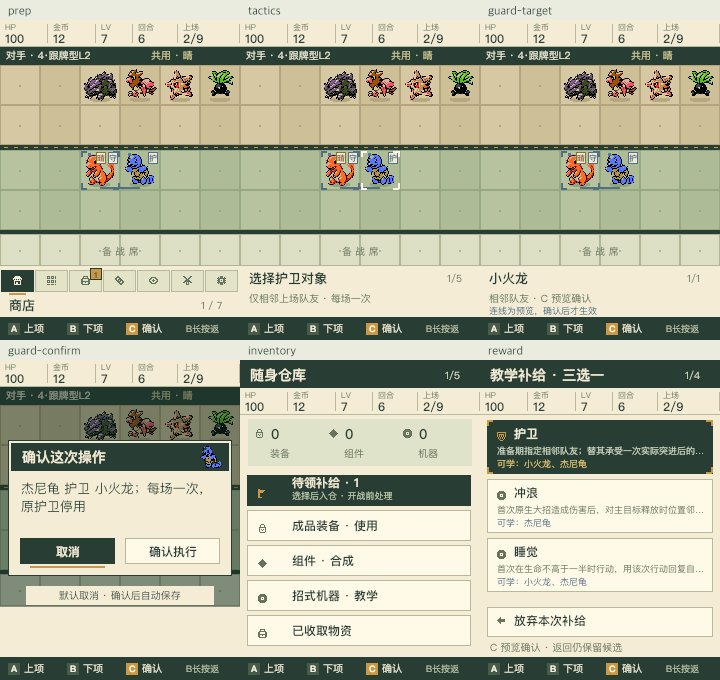
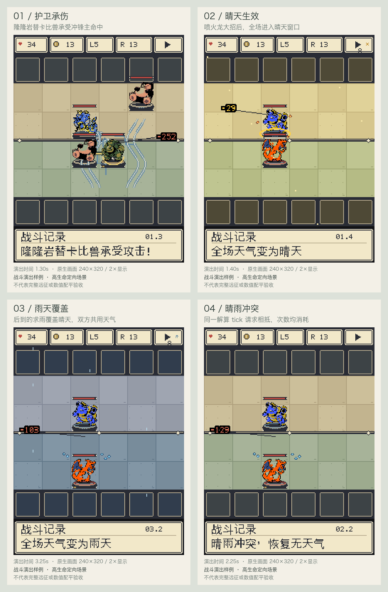

# 第八批：战术远征可试玩原型

2026-10-05；基线 `7c1262a`。本批在新模式中接通护卫、共享天气、技能机三选一、
三键岗位配置、存档与战斗演出。功能合同通过，**反突进强度与自然终局目标未通过**。
原经典/远征继续走 `base_v1`，新入口显式使用 `tactics_v1`。

入口：[设备模拟页](http://127.0.0.1:8807/device) →「战术远征 · 护卫与天气」。
完整语义见 [战术远征合同](../docs/23-tactical-expedition.md)。

## 1. 本批交付与系统联动

| 环节 | 可操作的行为 | 取舍与边界 |
|---|---|---|
| 获取 | 野怪奖励的一台技能机变为已冻结的三选一 | 领取/放弃后继续；不额外注入免费教学 |
| 学习 | 护卫所有棋子可学；晴天火/草、求雨水/电可学 | 普通宝可梦也能承担岗位；仍是一只一个教学槽 |
| 站位 | 选择护卫及相邻保护对象，或指定天气手 | 每队各一个有效名额；变阵失效会关闭并提示 |
| 战斗 | 护卫转移一次实际突进后的主命中；天气手首次原生大招后请求天气 | 护卫无额外减伤；天气不替换大招、不能追溯影响本次伤害 |
| 演出 | 护卫连线和实际承伤同步；显示天气开始、覆盖、冲突、结束、倒计时 | 只读权威事件；同一前缀不提前透露未来求雨 |
| 保存 | schema 4 保存规则、UID 配置、奖励候选和对手快照 | 重复领取幂等，写失败回滚，旧已知基线保持原行为 |
| AI | 使用相同的奖励、相容性和名额 | 当前为简单按阵容选择，尚未完成对手天气预测与收益估值 |

这是“获取应对件 → 给普通棋子分工 → 安排启动和保护 → 对抗对手窗口”的第一条完整流程。
训练、天赋、机制羁绊、定向商店和新局外挑战没有混入本批。

## 2. 两个天气队相遇的裁决

全场只保留一种天气，双方共享增益和削弱。单次覆盖暂定 8 秒：

- **先晴后雨**：先得到晴天窗口；求雨实际生效后覆盖为雨天，持续自己的窗口。
- **同 tick 一晴一雨**：下一 tick 统一相抵，恢复本轮基础天气，双方次数均消耗。
- **同种天气**：取较晚结束点，不叠加持续时长。
- **窗口到期**：恢复基础天气，不重新露出上一层教学天气。
- **天气手阵亡**：施法前阵亡则无请求；已请求后阵亡不会撤销效果。未选中的天气手不会接棒。

先启动可以争取首段收益，后启动可以覆盖。晴天也会帮助敌方火/草，雨天也会帮助敌方水，
因此不能只按本队属性总数评估天气。普通电伤没有雨天额外加成。
当前允许这些决策，不据此宣称天气队已经形成强度相当的多条路线。

## 3. 自动验收

| 验证 | 结果 | 范围 |
|---|---|---|
| 完整单元/合同测试 | 350 项通过 | 新护卫/天气、奖励、三键、动画和既有回归 |
| 统一执行器 | 4 项通过、6 项跳过 | 测试、编译、diff 检查、真实进程重启恢复；没有把跳过算作通过 |
| 旧规则固定存档 | 通过 | 旧代码生成的 schema 3 样本，后续操作状态一致、102 条事件哈希一致 |
| HTTP 三键真实帧 | 通过，83 帧 | 既有远征开战→自动播放→下一轮，真实 PNG、无重复提交；不是新模式的浏览器端到端验收 |
| 新模式三键合同 | 7 项通过 | 实际 PVE 奖励→领取→学习→护卫配置→开战；帧生成替身保留真实 Battle 参数 |
| 新战斗表现合同 | 7 项通过 | 护卫/闪避/派生包因果、天气覆盖、冲突、倒放、倍速、相同前缀 |
| 真实渲染样例 | 4 张关键帧、3 段连续 GIF | 使用 Battle 事件与实际渲染器；高生命定向场景，不代表完整对局或硬件性能 |
| 独立评审 | 两项时序、两项字体问题修复并复核通过 | 不认领数值、硬件和真人体验 |

主证据：[统一验收](evidence/tactics-2026-10-05/acceptance.json)、
[三键真实帧](evidence/tactics-2026-10-05/device-real-frame.json)、
[独立复核](evidence/tactics-2026-10-05/independent-review.json)、
[本批源码与证据清单](evidence/tactics-2026-10-05/source-manifest.json)。

独立评审关闭的问题：

1. 天气 HUD 原来取未来覆盖事件作为结束时间，导致提前透露后手施法；现仅依已发生的窗口显示。
2. 护卫关联的冲浪副包曾被误演为后续独立普攻；现以有界事件所属区间同步主命中，区间后的真实普攻保持独立。
3. 原生字库缺晴、雨、承、雹，导致新日志断字；通用绘字补充固定 16px 字模，运行时不依赖系统字体。
4. 通用补字后，雨/冰雹开场提示曾继续叠画旧字模；已统一优先级，原提示与新日志使用一致的字形。

## 4. 完整流程冒烟：32 局

[逐局证据](evidence/tactics-2026-10-05/full-run-probe.json)；32 个独立主种子，
四种 L2 人格各 8 局；新账号喷火龙家族开局。使用真实 Session 和奖励/学习/配置动作，
仅跳过 PNG 输出，保留生产部署方式和所有战斗参数。

| 指标 | 结果 |
|---|---:|
| 完成至整桌终局 | 32 / 32 |
| 战斗总数 / 玩家参与 | 4,055 / 834 |
| 异常 / 操作阻塞 | 0 / 0 |
| R6/R11 精确存档恢复 | 43 次，其中领奖前 23 次 |
| 全桌护卫触发 | 45 次 |
| 天气生效 / 晴雨冲突 | 2,126 / 3 次 |
| 终局未处理奖励 | 0 |
| 自然终局 / R31 排名收官 | 4 / 28 |
| 阵容变化导致配置失效 | 206 次，全部明确关闭后由代操作合法重选 |

卡池、技能机守恒与恢复后的完整 payload 一致均通过。206 次失效也提示需要真人检验
“变阵后重新分工”的操作负担；自动代操作未阻塞不等于三键体验轻松。

这 32 局只用于异常、事务和整局可推进检查。设计要求的多搭档、同行竞争、低血转型、
至少 100 个主种子的玩法评估尚未完成。L2 自动代操作不能换算为人类平均游戏时长。

## 5. 同预算战斗：4,400 场，护卫强度未放行

[完整实验](evidence/tactics-2026-10-05/combat-experiment.json)固定六人口、15 金棋子费用、
三件成装、一台教学，保留原花园、电流、突进、控场四队及原电流护卫失败方案。
22 个实验臂各运行同一组 100 个独立种子，每次额外交换阵营一次用于验证，共 4,400 场。
换边失败 0；换边不计作独立样本，不把跨实验臂复用的种子称为新增主种子。

护卫候选从探索种子 `310000–310019` 中预先冻结，正式种子为 `202610050–202610149`。
[探索历史证据](evidence/tactics-2026-10-05/guard-exploration.json)保留原版本指纹和全部失败读数，
只说明候选如何选出；当前数值结论取正式实验。

花园候选只交换部分站位；同站位分别比较原睡觉、换护卫但关闭、启用护卫：

| 对手 | 原睡觉胜率 | 护卫关闭 | 护卫启用 | 实际拦截的试验 |
|---|---:|---:|---:|---:|
| 原突进队 | 49% | 37% | 36% | 33 / 100 |
| 控场队 | 85% | 89% | 92% | 20 / 100 |
| 横向镜像突进队 | 21% | 20% | 20% | 0 / 100 |

对原突进队，启用护卫没有新增胜局，反而有一个种子从胜转负；失去睡觉的机会成本明显。
对控场队，启用本身带来 3 个种子从非胜变胜，幅度有限，不能解释为稳定优势提升。
镜像站位能完全绕开该候选护卫。原电流队的默认护卫位置仍无实际拦截，未证明能救活该体系。
每臂原始种子、触发率和 Wilson 95% 胜率区间均保留在 JSON 中。

天气的四个消融臂（都关闭、只晴、只雨、双方启动）中，花园对电流均为 100% 胜率。
事件、伤害与施法次数确有变化，但这个强弱悬殊样本无法说明天气的竞争价值；
不据“晴雨都能触发”认领天气体系配平。

## 6. 下一批的明确目标

| 优先项 | 要解决的联动问题 | 验收要求 |
|---|---|---|
| 护卫岗位与成本 | 守护者给核心争取一次施法，收益能覆盖放弃睡觉/冲浪的代价 | 固定原四队与失败臂；先比较岗位/站位，再独立评估机制调整；必须有收益场景和绕开方式 |
| 天气阵容与 AI | 天气手、启动、护卫、属性输出形成协作，AI 能判断是否帮助对手 | 增加实力接近的晴雨组合、无天气/单边/覆盖消融，记录双方受益和有效窗口 |
| 后期压力 | 成型后仍有人被淘汰，玩家资源能及时变现 | 对扣血或经济支出分别实验；降低 R31 收官依赖，不能用强制排名代替自然终局 |
| 中期投资 | 训练、进化、刷新与应对件形成竞争，而非金币只买人口 | 按设计第二批接事务和真实资源来源，逐项对照后再组合 |
| 天赋与机制羁绊 | 同一个核心能走保护、启动、控场等不同方向 | 先交付实际依赖与有界触发，再开放候选；不提前发尚未生效的选项 |
| 三键可用性 | 调站位、领奖与重新配置的成本可接受 | 多位真人计时和误操作记录，另做 ESP32 GPIO/NVS/帧耗时与内存验收 |

本批提供可试玩入口和上述失败证据；[设计文档](../docs/22-system-interactions-and-playstyles.md)
里的整批玩法放行条件仍未全部达成。

## 7. 复现与可视证据

```sh
python3 tools/acceptance/system_acceptance.py --output .build/tactics/acceptance.json
python3 tools/acceptance/tactical_run_probe.py --games 32 --seed-base 2026100500 --output .build/tactics/full-run.json
python3 sim/experiment_tactics.py --seeds 100 --start-seed 202610050 --output .build/tactics/combat.json
python3 tools/acceptance/tactical_visual_probe.py
```





连续演出：[护卫](evidence/tactics-2026-10-05/visual-guard.gif)、
[晴天被雨天覆盖](evidence/tactics-2026-10-05/visual-weather.gif)、
[同刻晴雨冲突](evidence/tactics-2026-10-05/visual-conflict.gif)。
样片使用高生命定向 fixture，顶部 HUD 是渲染器示例值，不能当作完整流程记录或数值实验。
