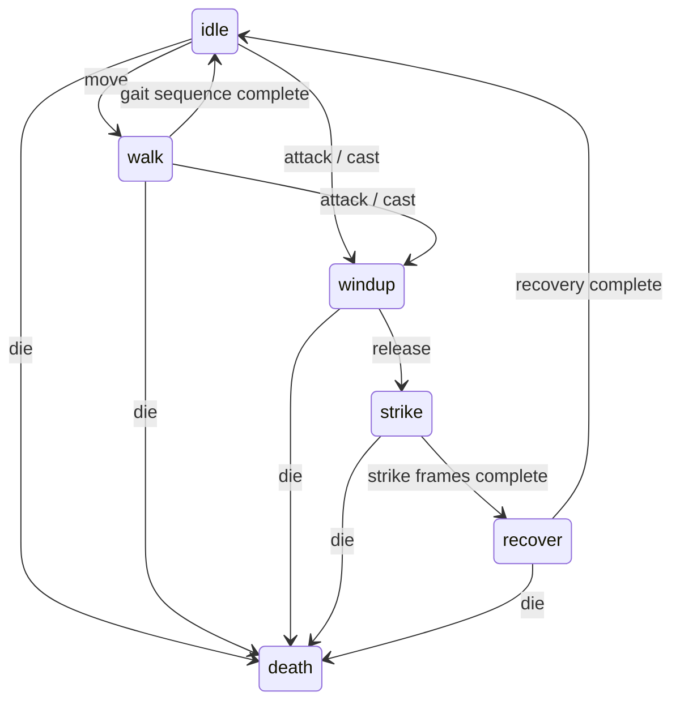

# 逐物种动作与技能美术验收

2026-10-04，基于 `49a0d46`。本批将 16 只商店宝可梦改为独立 authored 动作和技能视觉。只修改 `tools/mockups/**` 与 `reports/**`，不修改模拟、招式数据或 acceptance 服务，不执行 git commit。

[逐帧靶场](evidence/per-unit-2026-10-04/index.html) · [片段清单与确定性哈希](evidence/per-unit-2026-10-04/manifest.json) · [六状态及技能总览](evidence/per-unit-2026-10-04/contact-sheet.png) · [去色技能图册](evidence/per-unit-2026-10-04/skill-geometry-atlas.png) · [4× 动作图册](evidence/per-unit-2026-10-04/motion-4x-atlas.png)。HTML 需从静态 HTTP 服务打开，PNG/GIF 可直接查看。

**数据校正与边界**

- 隆隆岩的实际编号是 **76**；请求中的 47 是派拉斯特，且不在 84 只商店池中。本批按名称制作隆隆岩 76，仍为 16 authored + 68 fallback。
- 招式选择以只读 `roster.Piece.move_id` / `pokedex.signature_move` 为准，不把 combat 的通用技能名当作招式。喷火龙为 53 喷射火焰，卡比兽为 63 破坏光线；大岩蛇为 88 落石。旧大字爆炎与压顶图形仍保留在原 `signature_cast` 分支，供未带 authored 档案的模板调用。
- 三只水炮、两只喷射火焰、两只毒针均分别设计。`AUTHORED_SKILLS[species_id] = (move_id, name, design)` 同时校验物种与实际 move_id；属性只提供色板。
- 本轮改变展示动作、抬手时长、出手时刻、弹道/命中/数字的视觉时序。模拟伤害、HP 事件、技能机制、移动目的地与随机数完全不变。因此旧 combat archetype 的治疗、防御、突进等机制仍在，不能将新视觉理解为机制也已改成同名原作招式。HP 仍按原事件时刻更新，可能早于延后的视觉命中。

**MotionSystem 合同与后续作者指南**

数据入口为 `motion.species_motion[sid][state]`。每一帧是 `(dx, dy, sx, sy, tilt, blink)`，固定 10 Hz。`dx` 为沿攻向的像素位移，`dy` 为屏幕向下位移；`sx/sy` 使用整数百分比，100 为原尺寸；`tilt` 为角度；`blink` 是 0–3 的四阶有序透明剔除。消散不用混色或非二值 alpha。`REST=(0,0,100,100,0,0)`。



`hit` 是独立叠加轨，可叠到任意存活状态；死亡独立接管。冻结固定在 status onset 的采样姿态，死亡优先于冻结。所有取样读取已经推进的 AnimUnit 攻击、移动、死亡以及 cutin 事件，不预读未来攻击；倒放通过原游标重置再重放恢复。

普通攻击先播放本物种 0.2–0.4s 抬手，再进入 strike；近战命中延迟直接使用抬手长度，远程在原飞行时间上加新增准备时间。strike/recover、步态持续时间按各自帧表长度推导。技能抬手同样来自该物种帧表，随后的主体/命中视觉持续六帧。公共 `playback_frame` 经原 PlaybackClock 转回模拟时钟，击杀慢放、变速与 seek 不创建另一套动画时钟。

`RIGS[sid]` 是每只精灵的局部分区及其逐帧平移轨，坐标用不透明内容框的百分比表示。先从单帧源精灵切片、清除原区域并粘贴移动的切片，再做整数尺寸缩放、NEAREST 旋转、透明剔除。胡地勺光只提亮已有勺部像素，使用其原色板最亮色。结果保持 32/34px 原精灵画布，棋盘布局和精灵保护遮罩继续使用最终变形后的 alpha。

绘制器只在 `sid in species_motion` 时进入新路径。未建档物种继续执行 49a0d46 的原 pose/squash/gait/hit/death 路径；未建档技能继续执行原九 archetype 绘制（六个通用原语、三个旧 signature 分支）。不先运行新系统再用默认参数模拟旧结果。变形结果按物种、tier、状态、帧、受击、朝向、染色缓存；事件筛选仅在当前绘制帧内复用，退出即清空。

| 生物语言 | 局部动作与节奏 | 抬手 / 出手 | 受击 / 死亡 |
|---|---|---|---|
| 重型腹部 / 甲壳 | 腹部缓慢扩缩、肩炮升降、左右承重 | 后坐蓄压，2–3px 前冲并横展竖压 | 1px 颤；下沉压扁，后段剔除像素 |
| 念力人形 | 双臂/勺独立升降、勺面闪点、微浮沉 | 收拢后上浮聚焦，双臂释放 | 轻退挤压；缩窄上浮消散 |
| 鸟 / 有翼龙 | 翼片升降、翼缘收拢、喙前点 | 折翼后扬、啄冲或张翼出手 | 轻型退让；轻鸟上飘，重龙下沉 |
| 四足兽 | 前后腿反向移位、腾空伸展、落地压缩 | 低伏后抬头，前冲喷射 | 轻退形变；上飘剔除 |
| 蛇形 / 分节岩体 | 首、中、尾反相波动，身体伸缩传导 | 后仰拉长后向前甩头 | 小幅分节颤；折叠压缩下沉 |
| 鬼系 | 下半身偏移与透明密度呼吸、下沉再浮起 | 笑口扩张与前探 | 挤压相位叠加透明；原位直接溶解 |
| 鼠类 | 耳/尾反相轻颤、短促蹦步 | 下蹲聚电、弹射释放 | 退 1px + 明显挤压；上飘淡出 |

新增物种必须完整填写 idle/walk/windup/strike/recover/hit/death，并单独审阅分区；不可由 sid、速度、重量取模生成整套帧表。原地待机、行走、抬手、恢复要有可读的区别；避免持续高频抖动冒充呼吸。未完成的物种不要提前注册占位档案。

**16 只逐只动作与技能设计**

| 物种 / 真实招式 | 动作设计 | charge → 主体 → impact / 外围轮廓 |
|---|---|---|
| 6 喷火龙 / 53 喷射火焰 | 两翼分区收放、飞行波动；挺胸仰头 0.3s，前冲压缩，翼回收；重型落沉 | 翼侧吸热与口前聚气 → 五道持续锯齿锥流 → 五舌火冠、交替摆动尖端，两层火幕 |
| 65 胡地 / 94 精神强念 | 勺与双臂独立升降、勺光、微浮；收拢聚焦 0.4s，平展释放，浮沉恢复；缩窄上飘 | 双勺星点向眼前聚焦 → 保留相位错开的收缩念力环 → 外部收缩环与四方焦点 |
| 143 卡比兽 / 63 破坏光线 | 1.6s 腹部慢呼吸、双足左右承重；后坐蓄压 0.4s，腹部横展竖压，四帧慢恢复；下沉压扁 | 腹前横条逐层储能 → 分节矩形束体与粗芯 → 矩形冲击门、上下折角与侧向断柱 |
| 149 快龙 / 200 逆鳞 | 翅端与尾分离、重步跃起；扭腰后拉 0.3s，大角度回旋出手；重型侧倒下沉 | 对向爪弧内旋 → 三爪绕行与折返冲线 → 对向爪扫、破开的三角包围线 |
| 9 水箭龟 / 56 水炮 | 双肩炮独立升降、龟壳负重步；后坐 0.3s，双炮齐放反冲；甲壳小颤、下沉 | 两炮口各自压力环 → 双水柱交叉后扇开 → 双叶形水压边界及中轴碰撞尖峰 |
| 3 妙蛙花 / 76 日光束 | 花冠侧摇、前足交替；花背拉高聚光 0.4s，四足压低释放；宽体沉降 | 六瓣向花心收光 → 双边直光束、空心菱形花瓣沿轴推进 → 六个大空心花瓣放射 |
| 94 耿鬼 / 122 舌舔 | 下半身飘移、透明呼吸；笑口蓄势 0.3s，身体前探；原位溶解 | 弧形笑口张开 → 起伏长舌与末端回卷 → 下滴黏液、不对称下垂舌环 |
| 131 拉普拉斯 / 56 水炮 | 长颈轻摆、鳍片划水；伸颈仰头 0.3s，侧扫后回颈；侧倾下沉 | 沿颈向上的气泡 → 单股高压扇形左右扫射 → 四层宽水浪肋，边缘反卷 |
| 59 风速狗 / 53 喷射火焰 | 前后腿反向奔跑、腾空与落地压缩；低伏抬头 0.2s，奔袭吐火；轻退上飘 | 口前贴地热流 → 三个不同高度的疾驰火舌包 → 两侧锯齿火墙与贴地火带 |
| 130 暴鲤龙 / 56 水炮 | 头、中、尾反相波动；蜷身后仰 0.4s，甩头前冲；分段折叠下沉 | 三段弧线向口部汇压 → 蛇形脉冲水柱与压力截面 → 两侧交替波动的压力波前 |
| 31 尼多后 / 40 毒针 | 后足承重与肩部脊刺分区；守势后拉 0.3s，肩部扇射；重型小颤沉降 | 五肩刺向外张开 → 五枚毒针保护性扇射 → 长 V 形压力痕与针尖星点 |
| 34 尼多王 / 40 毒针 | 头角与尾分离、进攻重步；角尖后拉瞄准 0.2s，前冲刺击；扭身沉降 | 角前准线对轴 → 单角钻轴与螺旋齿 → 三层折线钻孔漏斗、上下刺穿尖角 |
| 76 隆隆岩 / 89 地震 | 拳臂两侧错拍、滚动步；下蹲承重后短跳 0.4s，落地重压；1px 硬颤、快速压扁 | 两足地压加载 → 棋盘尺度椭圆波前与分叉地裂 → 台阶状断层、碎石与侧裂 |
| 95 大岩蛇 / 88 落石 | 四段岩体反相传波；后仰拉伸 0.3s，头节甩石；逐节压缩下沉 | 三段石块依次抬起 → 三块错时抛物落石 → 五块独立空心棱石、细碎屑 |
| 18 大比鸟 / 17 翅膀攻击 | 喙前点、双翼收拢与飞行起伏；折翼蓄势 0.2s，展翼斩击；轻型退让上飘 | 两扇羽片展开 → 对向交叉翼弧与飞羽 → 三层双翼月牙及羽缘折线 |
| 26 雷丘 / 85 十万伏特 | 耳尾反相快颤、蹦跳步；下蹲聚电 0.3s，弹射释放；退 1px 挤压、上飘 | 双颊电火花与尾部接地线 → 六向多级分叉电网 → 不规则折线电笼与连接支路 |

**SkillFX 作者合同**

新招式分为 `draw_authored_phase(..., 'charge'|'body'|'impact', ...)` 与独立的 `draw_contact_field`。主体沿施法者→目标局部坐标绘制；外围命中轮廓确保近距离下主体被精灵遮罩裁切时仍保留该招式语义。所有大形状为空心轮廓，实心碎块保持小尺度；有独立运动的粒子向整盘 ParticleBudget 申请额度，固定轮廓与线条属于几何原语，沿用旧预算口径。预算耗尽时优先保留轮廓，粒子裁减。

两只宝可梦即使用同一 move_id，也应分别确定武器出口、路径、节奏、外围轮廓。允许复用线段、弧线、像素粒子这些低层绘图函数，不可只替换 type/color 或一个半径参数就注册新 authored 档案。新增档案必须同时通过：去色主体唯一、去色命中轮廓唯一、三靶实际渲染、回落逐位对照、遮罩与预算检查。哈希唯一只是排除完全相同图形，不能代替目视辨识；本批另检查放大图、灰度图及近距离完整战斗。

**靶场与左右对照**

六状态片段为真实 Battle 事件的隔离回放：保留原事件 tuple、时间和事件发生时的位置，移除并发行动，便于看清动作；不是捏造伤害或死亡事件。idle 只保留部署。walk 使用移动训练夹具并取 0.4s 后真实移动事件；strike 包含恢复段；hit 叠加在待机上；death 将训练主角 HP 设为 1，由实际 Battle 产生死亡。技能另出 48 个完整真实战斗片段，不做事件隔离。硬约束技能检查使用额外加厚 HP 的训练场，保证双 seed 中弱体型也能出招。

每只提供三靶 × 六状态的全帧 contact sheet；总览选 melee 的六状态和技能。左右对照逐只覆盖六状态，左侧加载 `git show 49a0d46` 的原 renderer/profile/skill 模块，右侧为当前实现，相同事件与模拟时刻。13 只此前未建档单位左侧是真正通用回落；三个主角左侧保留当时的旧 signature。源码指纹见 [baseline-source.json](evidence/per-unit-2026-10-04/baseline-source.json)。

| 对照 | 对照 | 对照 | 对照 |
|---|---|---|---|
| [喷火龙](evidence/per-unit-2026-10-04/6-comparison.png) | [胡地](evidence/per-unit-2026-10-04/65-comparison.png) | [卡比兽](evidence/per-unit-2026-10-04/143-comparison.png) | [快龙](evidence/per-unit-2026-10-04/149-comparison.png) |
| [水箭龟](evidence/per-unit-2026-10-04/9-comparison.png) | [妙蛙花](evidence/per-unit-2026-10-04/3-comparison.png) | [耿鬼](evidence/per-unit-2026-10-04/94-comparison.png) | [拉普拉斯](evidence/per-unit-2026-10-04/131-comparison.png) |
| [风速狗](evidence/per-unit-2026-10-04/59-comparison.png) | [暴鲤龙](evidence/per-unit-2026-10-04/130-comparison.png) | [尼多后](evidence/per-unit-2026-10-04/31-comparison.png) | [尼多王](evidence/per-unit-2026-10-04/34-comparison.png) |
| [隆隆岩](evidence/per-unit-2026-10-04/76-comparison.png) | [大岩蛇](evidence/per-unit-2026-10-04/95-comparison.png) | [大比鸟](evidence/per-unit-2026-10-04/18-comparison.png) | [雷丘](evidence/per-unit-2026-10-04/26-comparison.png) |

**最终验收读数**

| 合同 | 最终结果 |
|---|---|
| 帧表去色签名 | **16/16 唯一，120 对全部不同** |
| 同一测试 cel 的实际 alpha/位移形变 | **16/16 唯一**；不是用不同原精灵制造差异 |
| 技能主体去色几何 | **16/16 唯一，120 对全部不同** |
| 外围命中轮廓去色几何 | **16/16 唯一** |
| 实际 move_id | **16/16** 与只读数据一致 |
| 三靶六状态 | **288/288**；另有 **48/48** 完整战斗技能片段 |
| 双次独立构造渲染 | **336/336 片段，1875 帧 SHA-256 一致**；另外通过逐状态倒序 seek/回放时钟检查 |
| 左右对照 | **16 组**，每组覆盖六状态；另有每只全帧 contact sheet |
| 回落零漂移 | **4 只 ×（六状态 + 技能）= 28 组，156 帧 RGBA 逐位相同** |
| 精灵保护遮罩 | **0px** 外部 FX 遮挡，16 只 × 三靶 × 双 seed，共 **876** 张技能帧 |
| authored 精灵色板 / alpha | **447** 张动作帧，越界颜色 **0px**，非二值 alpha **0px** |
| 实心尺寸 | 普攻 32px 精灵最大 **23px / 71.88%**；34px 精灵最大 **25px / 73.53%**；authored 面状实心图元最大 **8px**，束体笔画最大 **5px** |
| 粒子 | 技能棋盘 FX 抽样峰值 **60/192**；完整压力回放峰值 **53/192**；饱和夹具 **192/192** |
| 编译 / diff / 所有权 | **8 个 Python 文件 compile 通过**；`git diff --check` 通过；禁区改动 **0**；HEAD 仍为 `49a0d46` |

[逐物种签名与运行时合同](evidence/per-unit-2026-10-04/contracts.json) · [遮挡/色板/粒子](evidence/per-unit-2026-10-04/hard-contracts.json) · [旧版回落对照](evidence/per-unit-2026-10-04/fallback.json) · [源码及范围指纹](evidence/per-unit-2026-10-04/source-and-scope.json)。实心尺寸沿用原命中面状图元的含端点跨度口径；束体长轴是路径，不作为实心命中圆直径。

| 原生 240×320 可见度指标 | seed 7 | seed 11 | 保留阈值 |
|---|---:|---:|---:|
| 失败数（含 R1 合同） | **0** | **0** | 0 |
| 普攻隔离最小差分 | **643px** | **668px** | ≥600px |
| 普攻逐帧最小差分 | **1986px** | **2359px** | ≥600px |
| 技能落点逐帧最小差分 | **2107px** | **2404px** | ≥1500px |
| 开场逐帧最小差分 | **4121px** | **6064px** | ≥2500px |
| 四种天气隔离最小差分 | **29713px** | **28764px** | ≥1200px |
| 同排精灵最大重叠 | **0px / 442 对** | **0px / 570 对** | ≤4px |
| 状态条连续遮挡 | **0 帧** | **0 帧** | ≤2 帧 |

完整数据：[双 seed visibility.json](evidence/per-unit-2026-10-04/visibility/visibility.json)。原 84 物种 × 七缩放相位、共 588 张基础精灵的色板回归也通过，越界颜色与部分 alpha 均为 0px。技能逐帧差分可能包含原有棋盘闪光；下表独立隔离 FX 并扣除精灵遮罩，不把闪光或震屏当成技能面积。

| 单位 | 普攻 / 技能 FX 可见面积 | 技能 / 普攻 | ≥1.7× 与仪式感合同 |
|---|---:|---:|---|
| 6 | 643 / 2248px | 3.496× | 通过 |
| 65 | 619 / 1578px | 2.549× | 通过 |
| 143 | 552 / 1826px | 3.308× | 通过 |
| 76 | 567 / 2686px | 4.737× | 通过 |

[两档分离与九原语回归](evidence/per-unit-2026-10-04/separation.json) 同时保留了普攻双描边、技能独立蓄力/外围轮廓、仅技能 2px 震屏、7/8px 数字和 80 能量呼吸预告检查。

**性能**

16 只、每只 25 个相同时间点，每轮 **400 帧**；五轮配对交替执行先后顺序，共每版本 2000 个计时样本。先预热同一批素材和变形缓存，计时只包含 `frame(show_cutins=False)`，不包含 Battle 构造、PNG/GIF 编码、哈希和写盘。最终测试在其他渲染专项结束后运行。

| 版本 | 五轮均值的中位数 |
|---|---:|
| 49a0d46 | **3.864925 ms/帧** |
| 最终 authored | **3.896006 ms/帧** |
| 增量 | **0.031081 ms，+0.80%** |
| ≤15% 门槛 | **通过** |

[逐帧样本、配对轮次与方法](evidence/per-unit-2026-10-04/benchmark.json)。这是本机暖缓存测量，未计首次解码/变形缓存建立，不作跨机器或统计显著性的性能保证。

QualityGate 本地读数：`gate/raw_gate=pass`、`block_merge=false`、`execution_complete/blocking_execution_complete=true`、`incomplete_engines=[]`、0 actionable block，CLI 自报 `quality_confidence=full`。`agent_action=local_checks_passed`，中央语义步骤仍未完成，原因见下文工具限制。Mutation 未执行（默认 disabled，CLI 原始字段 `not_applicable`），无语义修复轮次。


**验收口径与修复记录**

去色 motion 签名直接哈希六元帧表，另将全部物种应用到同一张测试 cel 后哈希 alpha/位移，排除“原精灵本来不同”带来的假阳性。SkillFX 主体与外围轮廓各自使用相同画布、起终点、六个相位，仅哈希 alpha，不包含名称、sid 或 RGB。16 份签名各检查 120 对。

回落比较选小拉达 19、大嘴雀 22、霸王花 45、水伊布 134：六状态与技能；目标均选未建档的大嘴雀，避免“目标本身已 authored”污染逐位对照。验证整张 RGBA 渲染帧，而非只比较配置。该采样不宣称穷举全部 68 只的每一种阵容；程序分支仍对全部未建档物种保持原路径。

旧 `r1_contract_check` 的攻击采样改为实际抬手/命中时间。旧属性双变体检查改用仍走通用路径的小拉达，保留 17 属性、双变体、轻中重、地痕寿命检查。旧 `vfx_separation_check` 中 0.4–0.5s 蓄力契约按本次用户裁定替换为 authored 0.2–0.4s（回落仍 0.4–0.5s）；统一多圆环断言替换为独立命中轮廓调用与新去色唯一性检查。面积 ≥1.7×、可见差分、实心尺寸、遮挡、粒子、确定性等门槛没有降低。

目视检查曾发现短距离技能被通用圆环主导，因此删除 authored 路径的统一圆环，改为上表逐物种外围轮廓；胡地、隆隆岩仍有符合招式语义的波纹。双 seed 检查随后发现喷火龙末帧差分 1362px，低于 1500px；通过交替火舌尖端摆动修复，不改阈值。

**剩余 68 只，建议分三批**

下面分组经 roster 集合校验：23 + 23 + 22 = 68，无重复、无遗漏。[机器清单](evidence/per-unit-2026-10-04/remaining-batches.json)。每批均独立建档，不将本批 rig/帧表当作整套物种模板复制。

| 批次 | 范围 | 设计重点 |
|---|---|---|
| 第二批，23 只 | 1 妙蛙种子、2 妙蛙草、43 走路草、44 臭臭花、45 霸王花、69 喇叭芽、70 口呆花、71 大食花、10 绿毛虫、11 铁甲蛹、12 巴大蝶、13 独角虫、14 铁壳蛹、15 大针蜂、16 波波、17 比比鸟、21 烈雀、22 大嘴雀、41 超音蝠、42 大嘴蝠、92 鬼斯、93 鬼斯通、123 飞天螳螂 | 叶片、藤、花、蛹、虫翼、鸟翼、蝠翼、气体分别设分区；粉云、叶刃、吸取与气体招式按真实 move_id 设计 |
| 第三批，23 只 | 4 小火龙、5 火恐龙、19 小拉达、20 拉达、25 皮卡丘、29 尼多兰、30 尼多娜、32 尼多朗、33 尼多力诺、37 六尾、38 九尾、56 猴怪、57 火暴猴、58 卡蒂狗、63 凯西、64 勇基拉、66 腕力、67 豪力、68 怪力、133 伊布、135 雷伊布、136 火伊布、55 哥达鸭 | 拳、四臂、咬、尾、耳、角、毛发、念力器具；同进化链也单独审阅抬手和命中轮廓 |
| 第四批，22 只 | 7 杰尼龟、8 卡咪龟、54 可达鸭、60 蚊香蝌蚪、61 蚊香君、62 蚊香泳士、74 小拳石、75 隆隆石、79 呆呆兽、80 呆壳兽、81 小磁怪、82 三合一磁怪、111 独角犀牛、112 钻角犀兽、116 墨海马、117 海刺龙、120 海星星、121 宝石海星、129 鲤鱼王、134 水伊布、147 迷你龙、148 哈克龙 | 游泳、尾鳍、壳旋、滚岩、磁悬浮、多体联动、星形旋转、软体与蛇形；水系同招重点区分出口、压力和波形 |

**修改清单**

| 文件 | 内容 |
|---|---|
| `tools/mockups/motion.py`（新） | 16 只七状态帧表、16 套局部分区、事件状态解析、受击叠加、冻结/死亡优先级、单 cel 合成 |
| `tools/mockups/skill_vfx.py` | 实际 move_id 适配、16 套蓄力/主体/命中/外围轮廓；保留旧模板回落 |
| `tools/mockups/render_battle_gif.py` | authored 分支接线、同步准备与飞行/命中时刻、最终形变遮罩、帧内事件复用与变形缓存 |
| `tools/mockups/profile_range.py` | 新增死亡 HP=1 与技能加厚 HP 训练选项，旧默认行为不变 |
| `tools/mockups/per_unit_evidence.py`（新） | 336 片段生成、双渲染哈希、实际旧 commit 加载、回落对照、去色签名、全部 authored 色板/遮挡检查、配对性能测试 |
| `tools/mockups/r1_contract_check.py` | 时间采样适配新抬手；原尺寸/遮挡/粒子断言保留 |
| `tools/mockups/fx_visibility_check.py` | 旧通用双变体夹具换为未建档物种；所有阈值保留 |
| `tools/mockups/vfx_separation_check.py` | 区分 authored 与旧回落的蓄力/轮廓契约；保留面积、数字、震屏、能量、原语检查 |
| `reports/evidence/per-unit-2026-10-04/**` | PNG/GIF、图册、16 组对照、日志、JSON 指标、指纹与后续批次清单 |
| 本报告 | 系统/作者合同、逐只设计、验收读数、边界与后续计划 |

**工具检查与限制**

QualityGate CLI 本地检查作为辅助证据。当前 Host 未注册其 MCP；仓库 readiness 尚未注册，runner check 缺 Go/Mutation 相关组件，且安装目录在允许写入范围之外，未安装或升级。因此没有中央 pre-edit 规则或中央语义评审结论，不把本地 PASS 称为完整中央验收。Mutation 按默认关闭，未执行。具体 CLI 读数见 [qualitygate.json](evidence/per-unit-2026-10-04/qualitygate.json)。主验收依据为本报告的实际渲染专项检查。

素材仍为单帧，局部分区和 NEAREST 变形不能生成素材中不存在的背面、完整闭眼五官或真正三维转身；超出原 32/34px 盒的旋转边缘会裁切。透明呼吸/死亡使用四阶有序剔除，放大看得到像素网格。棋盘精灵遮罩优先于技能：极近距离会裁掉部分束体，因此特意设计外沿语义轮廓，但不保证所有细节在所有拥挤阵容中都完整可见。素材环境相同的确定性已验证，未声称跨 Pillow/平台逐位一致。

**复现**

```sh
PYTHONDONTWRITEBYTECODE=1 python3 tools/mockups/per_unit_evidence.py --mode contracts
PYTHONDONTWRITEBYTECODE=1 python3 tools/mockups/per_unit_evidence.py --mode range
PYTHONDONTWRITEBYTECODE=1 python3 tools/mockups/per_unit_evidence.py --mode hard
PYTHONDONTWRITEBYTECODE=1 python3 tools/mockups/fx_visibility_check.py --output reports/evidence/per-unit-2026-10-04/visibility
PYTHONDONTWRITEBYTECODE=1 python3 tools/mockups/vfx_separation_check.py --output reports/evidence/per-unit-2026-10-04
# 其他渲染/验收结束后单独运行，避免并行负载污染性能：
PYTHONDONTWRITEBYTECODE=1 python3 tools/mockups/per_unit_evidence.py --mode benchmark
```
